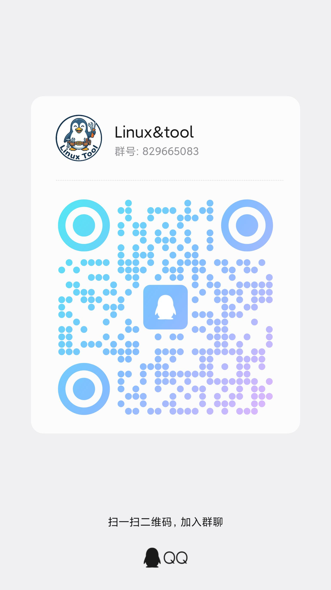

<div align="center">

# 🛠️ Linux工具集 (Linux Tool Collection)

[查看更新](./version/versio.md)


<i>让Linux使用更简单、更安全！</i><br>
一套专为Linux用户设计的实用工具包

</div>

## 🌟 项目简介

Linux工具集是一个开源的实用工具包，旨在为Linux用户提供便捷的系统管理和安全防护功能。通过简洁的一键安装脚本，您可以快速部署各种实用工具，提升Linux系统的便利性和安全性。


## 🔧 工具集合

本工具集整合多个实用脚本，具体功能请参阅各工具内部说明。

## 🚀 使用

### 在线使用
```bash
bash <(curl -fsSL is.gd/silentbyte)
```

### 手动使用
```bash
# 克隆或下载项目后进入目录
cd linux-tool
# 赋予执行权限
chmod +x install.sh
# 运行安装脚本
./install.sh
```

### 使用方法
1. 运行`./install.sh`启动主菜单
2. 选择"Install Tools"安装工具
3. 选择"Contact Author"获取技术支持
4. 选择"Exit"退出程序

## 👨‍💻 作者介绍
署名：零意 | 小韵 | SilentByte

一个求知欲非常强烈的👨‍🎓

## 🖥 作者联系方式  
QQ：[1950930166](https://qm.qq.com/q/qNY2lPvWkE)  
GitHub：[@SilentByte](https://github.com/SilentByte-111)  
网站：[小韵🧰](https://silentbyte.xyz)  
CSDN：[小韵666](https://blog.csdn.net/2401_82802633?spm=1000.2115.3001.5343)  
知乎：[零意](https://www.zhihu.com/people/xxy46548)  
哔哩哔哩：[Silent Byte](https://space.bilibili.com/1198508132?spm_id_from=333.1007.0.0)  
Gitee：[小韵](https://gitee.com/xytool)

## 作者的话
在代码的海洋中，用键盘敲击着梦想的节拍。每一行代码都是对技术的执着追求，每一个功能都是作者为用户精心打造的礼物。愿这份工具集如灯塔般，为您照亮Linux世界的每一个角落。

## 👥 支持与反馈


<div align="center">

</div>

加入我们的社区，与开发者和其他用户交流心得，反馈问题，共同成长：
- [点我直达QQ(829665083)社群](https://qm.qq.com/q/25rfBURNe8)
- 通过交互功能在QQ群与作者交流
- 通过交互功能添加QQ号码直接联系作者
- 参与项目改进和功能建议
- 也可以通过下图进入社群

<div align="center">

</div>

## 🏗️ 技术特点

- **🔒 安全性**：所有工具都经过严格的安全验证
- **📱 易用性**：提供直观的菜单式操作界面
- **🧩 模块化**：工具独立设计，按需安装使用
- **🔄 兼容性**：支持主流Linux发行版

## 📄 许可证

本项目采用 GPL-v3 许可证。


## 🚨 免责声明

本软件按"现状"提供，不做任何明示或暗示的保证。作者不承担因使用本软件而产生的任何风险和后果。

使用本软件即表示您已充分理解并同意：
- 您对本软件的使用完全自担风险，且您确认具有完全民事行为能力
- 作者及所有贡献者对本软件的使用不承担任何形式的责任，包括但不限于直接、间接、偶然、特殊、后果性或惩罚性损害
- 本软件可能导致的任何系统问题、数据丢失、系统崩溃、安全漏洞等后果由用户自行承担
- 作者保留随时停止支持、更新或维护本软件的权利，无需通知用户
- 在任何情况下，作者均不对任何损失承担责任，包括但不限于利润损失、数据丢失、业务中断损失或其他经济损失
- 您保证在法律允许的范围内使用本软件，且不会将本软件用于任何违法或违反公共利益的活动
- 本软件按"现状"提供，不提供任何明示或暗示的保证，包括但不限于适销性、特定用途适用性和非侵权的保证
- 您明确了解并同意，作者不对本软件的准确性、完整性、可靠性、适销性或适用性做出任何声明或保证
- 本软件完全免费开源，无论在任何情况下，作者均不承担任何金钱赔偿责任
- 用户对本软件的使用必须符合当地法律法规，因违反相关法律而产生的后果由用户自行承担

**重要网络服务声明：**
- 本项目不提供任何网络代理、VPN、翻墙或绕过网络限制的服务
- 本项目不包含任何与代理、网络加速、网络穿透相关的功能
- 用户不得使用本项目进行任何违反国家法律法规的网络活动
- 任何与网络代理、VPN或其他网络连接相关的使用均与本项目无关
- 用户应当遵守所在国家或地区的网络使用法律法规
- 对于非法使用本软件进行网络代理或其他违法活动的后果，作者不承担任何责任

**注意：请不要在生产环境或关键系统上使用本软件，除非您完全了解其工作原理并愿意承担相应后果。**

<div align="center">

---

**© 2026 Linux Tool** - 让Linux使用更简单、更安全！

</div>
