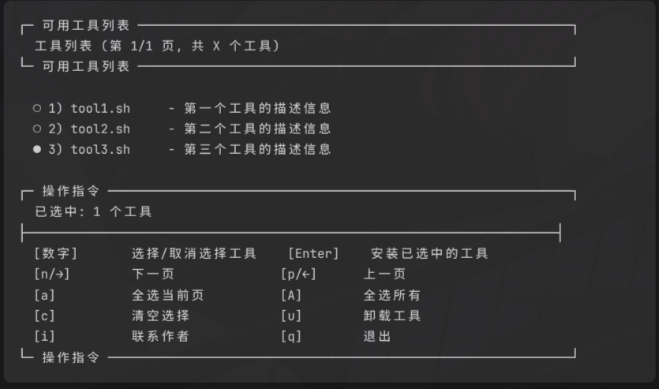

# (LINUX TOOL)版本介绍
[主仓库](../README.md)|
查看版本 | [工具目录](../dock/dock.md)

## v1.0   ⌚2025-12-16
- Linux tool 正式成立
- install 交互诞生
- [文本logo](assets/logo.txt)
- [fuck_rm 全局命令](fuck_rm.md)
- 预览图如下

## v1.1   ⌚2025-12-17
- 更新ui 增添提示的美观和可读性
- 增加install在线功能的健壮性
- 新提示UI如下图

## v1.2   ⌚2025-12-17
- 修复♻️体逻辑漏洞
- 修复logo反复出现
- 添加了作者联系渠道